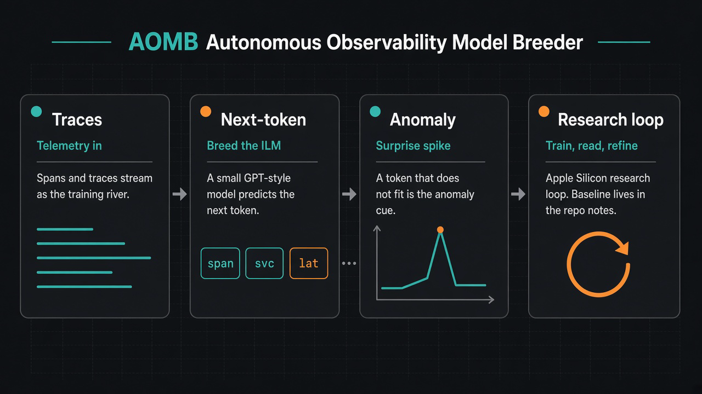

# Autonomous Observability Model Breeder (AOMB)

[](https://github.com/pandeyaby/AOMB/actions/workflows/diptych-adapter-gate.yml)
[](https://github.com/pandeyaby/AOMB/actions/workflows/stranger-demo.yml)
[](https://github.com/pandeyaby/AOMB/actions/workflows/public-ranking-card-v1.yml)



> *"Frontier AI research used to require meat computers. Now it runs overnight on your MacBook."*

**AOMB** breeds an **Infrastructure Language Model (ILM)** — next-token prediction on observability telemetry. Lower **`val_bpb`** = better grasp of *normal* = surprise becomes the anomaly signal.

Companion (not the same product): **[DIPTYCH](https://github.com/pandeyaby/DIPTYCH)** grades **2-safety / calibration** on **paired** probes. AOMB emits fixtures; DIPTYCH grades. Do not merge the products. Do not fork DIPTYCH harness/product code into this repo beyond the existing adapter emit path.

Write-up: [I Let an AI Improve Itself Overnight…](https://medium.com/@pandeyaby/i-let-an-ai-improve-itself-overnight-heres-what-i-woke-up-to-6db1905fc212)

---

## Stranger demo (Linux / CI — no MPS, no API keys)

Just cloned? Prove the public gates without Apple Silicon or Anthropic/OpenAI keys:

```bash
uv sync                          # or: pip install pyarrow numpy rustbpe tiktoken
                                 # + CPU torch for full card: pip install torch --index-url https://download.pytorch.org/whl/cpu
./scripts/stranger_demo.sh       # full-8 + gate_axis_mutate, then ranking-card harness smoke
# faster subset (baselines ε only):  STRANGER_FAST=1 ./scripts/stranger_demo.sh
```

**Honest:** public ranking card = **`published_fixture_card` / harness smoke** (tiny-n synthetic). Lab AUROC stays **`not_published`** — no invented AUROC. CRISP **`val_bpb`** = train fitness only. Overnight agent / MPS product train = Mac path below — **not** this script.

Details + what still needs MPS: [`docs/stranger-demo.md`](docs/stranger-demo.md).

---

## Three lanes (do not mix numbers)

| Lane | What it is | Honest claim |
|------|------------|--------------|
| **1. Train — Uber CRISP** | Real public Jaeger traces | Factual **`val_bpb` only** — no incident labels → **not** ranking accuracy |
| **2. Lab — private** | Docker stack + faults (optional redacted pack) | Ranking evidence under [`docs/lab/`](docs/lab/) — default **`not_published`** |
| **3. Public fixture card** | Tiny synthetic pack + CI | **`published_fixture_card`** = **harness smoke** that beat baselines — **not** lab / production ranking |

Details: [`docs/corpus-v1.md`](docs/corpus-v1.md) · [`docs/crisp-val-bpb-baseline.md`](docs/crisp-val-bpb-baseline.md) · [`docs/public-ranking-card-v1.md`](docs/public-ranking-card-v1.md) · [`docs/lab/`](docs/lab/) · [`docs/public-accuracy-eval.md`](docs/public-accuracy-eval.md) · [`docs/stranger-demo.md`](docs/stranger-demo.md).

---

## One commands

```bash
uv sync

# Stranger path (no MPS / no keys) — preferred first run off Mac
./scripts/stranger_demo.sh

# Or individually:
./scripts/run_diptych_full8.sh              # DIPTYCH full-8 + gate_axis_mutate
./scripts/run_public_ranking_card_v1.sh     # harness smoke (CPU torch OK)

# Smoke train (synthetic corpus — CI/dev only, not the product train story)
uv run python generate_observability_corpus.py
uv run python prepare.py --num-shards 20
# 60s train smoke — see Quickstart below
```

**Product train (Uber CRISP):** see [Train on Uber CRISP](#train-on-uber-crisp).  
**`aomb=green`** in coverage requires **`gate_axis_mutate`** (CI asserts `axis_power=true` on all 8 operators).

---

## How the pieces fit

```
breed / score loop  →  fixtures  →  DIPTYCH paired probes (grade 2-safety)
     (AOMB emit)                        (companion — calibration claims)
```


Paper / IEEE copy: [`docs/images/`](docs/images/) · mermaid source [`docs/diagrams/aomb-diptych-architecture.mmd`](docs/diagrams/aomb-diptych-architecture.mmd) · adapter notes [`docs/paired-probes/`](docs/paired-probes/).

---

## Quickstart

```bash
# Requirements: macOS + Apple Silicon, Python 3.10+, uv
# Optional for real corpus: Docker (lab), ~2.3GB disk+net for Uber CRISP fetch

curl -LsSf https://astral.sh/uv/install.sh | sh
uv sync

# Prefer real Uber CRISP for training (Three lanes). Smoke path:
uv run python generate_observability_corpus.py   # SMOKE / CI ONLY
uv run python prepare.py --num-shards 20         # sacred — do not edit

# 60-second train smoke
uv run python -c "
import signal, sys
signal.signal(signal.SIGALRM, lambda s,f: sys.exit(0))
signal.alarm(60)
exec(open('train.py').read())
" 2>&1 | tail -5

# Anomaly story — look for anomalous/cascade mean_bpb >> normal
uv run python demo_anomaly.py

# Overnight agent + morning report
caffeinate -i uv run python agent_loop.py >> logs/agent_loop.log 2>&1 &
uv run python morning_report.py --plot
```

---

### Train on Uber CRISP

```bash
uv run python -m corpus.ingest.fetch_crisp                 # or --download (~2.33 GB, not CI)
uv run python -m corpus.ingest.build_shards \
  --adapter crisp_zenodo \
  --input ~/.cache/autoresearch/corpus-v1/crisp/extracted \
  --num-train-shards 8 --write-val-shard
uv run python prepare.py --num-shards 8
uv run python train.py
```

Current factual CRISP `val_bpb` (training fitness, **not** accuracy): **0.407753** (500k spans) · overnight 200k best **0.4309**. Tables: [`docs/crisp-val-bpb-baseline.md`](docs/crisp-val-bpb-baseline.md).

### Lab capture (labeled, unpublished by default)

```bash
cd lab && docker compose up -d --build && ./scripts/run_capture_session.sh && cd ..
```

Private captures stay local. Redacted pack: [`corpus/fixtures/lab_public_pack_v0/`](corpus/fixtures/lab_public_pack_v0/) (`claim_status=not_published`). Lab ranking numbers stay in [`docs/lab/`](docs/lab/) — **not** README heroes.

### Public ranking card (harness smoke)

```bash
./scripts/run_public_ranking_card_v1.sh
```

Synthetic fixture only. Soft status: **`published_fixture_card` / harness smoke** — not production AUROC, not a lab ranking claim. Lab lane stays **`not_published`**. See the card doc. Do not put fixture AUROC on the README hero.

### DIPTYCH paired probes (hyperproperty grading)

[DIPTYCH](https://github.com/pandeyaby/DIPTYCH) grades **calibration** as 2-safety hyperproperties: not one run, but a coupled pair that shares all exogenous inputs except one controlled perturbation. AOMB’s full-8 adapters are already merged (`diptych_schema=0.2`); this repo emits the product probes that DIPTYCH grades.

```bash
./scripts/run_diptych_full8.sh
```

All 8 operators × conforming/violating under `diptych-probes/` (`diptych_schema=0.2`). Coverage: `coverage/matrix.json`. Docs: [`docs/paired-probes/`](docs/paired-probes/).

**Adapter CI is required.** `.github/workflows/diptych-adapter-gate.yml` must stay green (runs on every push to `main`). Cells turn `aomb=green` only when twin contrast **and** `gate_axis_mutate` (power-on-axis) both pass — cosmetic verdict flips / SARIF renames / AUROC injects do not count. **Not** lab AUROC; **not** a public ranking claim. Calibration grading belongs to [DIPTYCH](https://github.com/pandeyaby/DIPTYCH).

Architecture (pieces fit): 

Calibration path: 

### BYO / synthetic smoke

- BYO dumps: [`docs/byo-and-scorer.md`](docs/byo-and-scorer.md) — scoring ≠ published accuracy.
- `generate_observability_corpus.py` = smoke / CI only — **not** the flagship train story.

---

## How It Works

```
┌─────────────────────────────────────────────────────────┐
│                    AGENT LOOP                           │
│                                                         │
│  program.md + train.py + git log                        │
│         │                                               │
│         ▼                                               │
│   claude --print ──► proposed train.py                  │
│         │                                               │
│         ▼                                               │
│   uv run train.py  (5 minutes, MPS)                     │
│         │                                               │
│         ▼                                               │
│   val_bpb improved? ──Yes──► git commit ──► loop        │
│         │ No                                            │
│         ▼                                               │
│   restore backup ──────────────────────────► loop       │
└─────────────────────────────────────────────────────────┘
```

**Three files. That's the whole system.**

| File | Who touches it | What it is |
|------|---------------|------------|
| `prepare.py` | Nobody | Data pipeline, tokenizer, `evaluate_bpb` — sacred, never modified |
| `train.py` | The Claude agent | Model architecture + training loop — the only thing that changes |
| `program.md` | You (rarely) | Research constitution — domain context, experiment queue, constraints |

The agent loop (`agent_loop.py`) drives the cycle automatically. You set it and forget it.

A domain-specific fork of [Andrej Karpathy's autoresearch](https://github.com/karpathy/autoresearch) —
adapted for Apple Silicon by [miolini/autoresearch-macos](https://github.com/miolini/autoresearch-macos).

---

## The Idea

Monitoring tools today are rule-based and threshold-driven. Someone decided `latency_ms > 500` means alert.
The on-call engineer gets paged 847 times a week. 803 are noise.

AOMB takes the language model approach: **train a model to predict what comes next in your telemetry stream.**
A model that predicts well has learned what *normal* looks like. Anomalies are sequences the model finds surprising.
No rules. No labels. No thresholds. Just next-token prediction — and the anomaly detection is a free consequence.

The training objective (`val_bpb` — validation bits-per-byte) *is* the anomaly detection capability.
Lower val_bpb = model understands your infrastructure's language = better anomaly detector.

An ILM trained on your own telemetry has an anomaly detector no vendor can replicate — because the model learned the statistical fingerprint of that specific environment.

---

## The Training Data (legacy synthetic smoke path)

> Prefer **Uber CRISP** (Three lanes). The shards below are what `generate_observability_corpus.py` produces for smoke/CI.

21 parquet shards (~22 MB) in `~/.cache/autoresearch/data/`.
Each row is a coherent session of 8–60 correlated events across telemetry sources:

```
[ts=2026-03-08T18:00:00Z] [src=APMTracer] [svc=payment-gateway] latency_ms=420 error=timeout trace_id=a3f9 http_status=500 drift_score=0.87
[ts=2026-03-08T18:00:01Z] [src=NetIntel] path=internet→aws-us-east-1 latency_ms=3200 packet_loss=0.123 bgp_changes=3
[ts=2026-03-08T18:00:01Z] [src=LogStream] level=CRITICAL svc=auth msg=circuit_breaker_open latency_ms=28500 pagerduty=triggered
```

**Statistical properties:** ~91% normal, ~6% anomalous, ~3% cascade failures.
BPE vocab of 8,192 tokens — field names like `latency_ms=`, `trace_id=` become single tokens.

---

## Visualize the Corpus

```bash
uv run python visualize_corpus.py            # report + corpus_overview.png
uv run python visualize_corpus.py --no-plot  # terminal-only
uv run python visualize_corpus.py --samples  # normal / anomalous / cascade
```

---

## The Model Architecture

Not vanilla nanoGPT. Built-in from day one:

| Component | What it does |
|-----------|-------------|
| **RoPE** | Rotary position embeddings — relative position |
| **GQA** | Grouped Query Attention — memory efficient |
| **Sliding window** | `WINDOW_PATTERN="L"` — per-layer full or half-context |
| **MuonAdamW** | Muon for matrices, AdamW for embeddings |
| **Value Embeddings** | ResFormer-style residual on alternating layers |
| **Logit softcapping** | `tanh(x/15)×15` |
| **RMSNorm** | Everywhere, no bias |

**What the agent explores:** `DEPTH`, `ASPECT_RATIO`, `HEAD_DIM`, `WINDOW_PATTERN`, 4-way LRs, warmup/warmdown, `TOTAL_BATCH_SIZE` — see top of `train.py`.

---

## Results (where the numbers live)

- **CRISP `val_bpb` (train fitness):** [`docs/crisp-val-bpb-baseline.md`](docs/crisp-val-bpb-baseline.md)
- **Public fixture card (harness smoke):** [`docs/public-ranking-card-v1.md`](docs/public-ranking-card-v1.md) · `reports/public-ranking-card-v1/CARD.md` — clone→CI smoke only; **no AUROC hero**
- **Lab ranking (private / redacted pack):** [`docs/lab/`](docs/lab/) — `not_published` by default
- **DIPTYCH calibration grading:** [pandeyaby/DIPTYCH](https://github.com/pandeyaby/DIPTYCH) · local emit path [`docs/paired-probes/`](docs/paired-probes/) — adapter CI + `gate_axis_mutate` required

No AUROC heroes on this README. Legacy synthetic overnight `val_bpb` history stays in git / morning reports — not the product headline.

---

## val_bpb — The Only Metric That Matters (train lane)

```
val_bpb = total_nats / (log(2) × total_bytes)
```

Bits-per-byte is vocabulary-independent within a fixed tokenizer/corpus.
**Do not treat scores from different corpora as interchangeable** (e.g. CRISP-500k **0.407753** vs overnight 200k **0.4309** vs synthetic **0.3682**).

| val_bpb | What it means |
|---------|---------------|
| > 4.0 | Model barely beats random — hasn't learned field structure yet |
| 1.5 – 4.0 | Early convergence — learning token distributions |
| 0.8 – 1.5 | Good — model understands normal telemetry patterns |
| 0.4 – 0.8 | Strong — implicit anomaly detector, approaching production use |
| **0.407753** | **← CRISP-500k `TIME_BUDGET`; factual training metric only — not a public accuracy claim** |
| **0.4309** | **← CRISP overnight best on 200k subset; README fact only — not a public accuracy claim** |
| 0.458756 | ← CRISP pre-overnight 200k floor |
| **0.3682** | **← synthetic smoke-era best; separate table — not comparable to CRISP** |
| < 0.35 | Excellent — deploy as zero-shot anomaly scorer |

Minimizing val_bpb = minimizing KL(P_data ‖ P_model). Surprise on anomalous sequences is free.
**The training objective IS the anomaly detection capability. No separate head. No labels.**

See [`docs/public-accuracy-eval.md`](docs/public-accuracy-eval.md) for the ranking protocol (separate lane).

---

## Observability Sources in the Corpus

| Source | Signal type |
|--------|-------------|
| **APMTracer** | APM traces, latency, error rates, GPU/AI agent cost drift |
| **NetIntel** | Network path quality, BGP stability, DNS, packet loss |
| **LogStream** | Structured logs, SIEM alerts, security events |
| **OpenTelemetry** | Distributed trace spans, service dependency chains |
| **WANController** | Branch WAN link health, QoS violations, bandwidth utilization |
| **APMTracer-BizTxn** | End-to-end business transaction health snapshots |

---

## Morning Report

```bash
uv run python morning_report.py --plot
```

Generates `overnight_progress.png` alongside the terminal report (experiments, best `val_bpb`, restore SHA).

---

## The Agent Loop

```bash
caffeinate -i uv run python agent_loop.py >> logs/agent_loop.log 2>&1 &
tail -f logs/agent_loop.log
kill $(cat logs/agent_loop.pid)
```

Config (top of `agent_loop.py`): `MAX_EXPERIMENTS`, `CLAUDE_TIMEOUT`, `TRAIN_TIMEOUT`, `CLAUDE_MODEL`.

```bash
AOMB_ANTHROPIC_API_KEYS=sk-ant-...   # comma-separated
AOMB_OPENAI_API_KEYS=sk-proj-...     # optional fallback
AOMB_CLAUDE_MODELS=sonnet            # or: opus, haiku, gpt-4o-mini
```

Every improvement is a git commit. Every 10 successes, results push to GitHub.

---

## Scheduled Morning Report

```bash
AOMB_DIR="$(pwd)"
sed "s|AOMB_DIR|${AOMB_DIR}|g" com.aomb.morning-report.plist.template \
  > ~/Library/LaunchAgents/com.aomb.morning-report.plist
launchctl load ~/Library/LaunchAgents/com.aomb.morning-report.plist
```

> Generated `.plist` lives in `~/Library/LaunchAgents/` and is gitignored.

---

## Repository Lineage

```
karpathy/autoresearch          (original — H100, NVIDIA)
       │
       └── miolini/autoresearch-macos   (macOS/MPS port)
       │          │
       │          └── trevin-creator/autoresearch-mlx  (MLX native)
       │
       └── pandeyaby/AOMB  ← you are here
                   Domain: enterprise observability telemetry
                   Loop:   Fully autonomous (agent_loop.py)
                   Goal:   Minimize val_bpb → maximize implicit anomaly detection
                   Companion grading: DIPTYCH (paired probes / 2-safety)
```

---

## Requirements

**Stranger / CI path (Linux OK):** Python 3.10+, `uv` or pip — see [`docs/stranger-demo.md`](docs/stranger-demo.md). No MPS. No API keys.

**Overnight research loop (Mac):**

- macOS with Apple Silicon (M1/M2/M3/M4)
- Python 3.10+
- `uv` package manager
- An Anthropic API key (`AOMB_ANTHROPIC_API_KEYS`) — or Claude Code CLI fallback
- ~500 MB disk for corpus + tokenizer (more for CRISP download)

---

## License

MIT — builds on [miolini/autoresearch-macos](https://github.com/miolini/autoresearch-macos) (MIT)
which builds on [karpathy/autoresearch](https://github.com/karpathy/autoresearch) (MIT).

*Authored by Abhinav Pandey*
