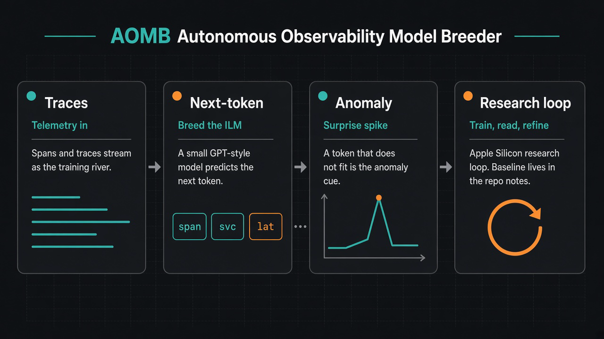

# AOMB — Autonomous Observability Model Breeder

**A small language model that learns what normal telemetry looks like, and an AI research agent that tries to improve it while you sleep.**

[](https://github.com/pandeyaby/AOMB/actions/workflows/stranger-verify.yml)
[](https://github.com/pandeyaby/AOMB/actions/workflows/stranger-demo.yml)
[](https://github.com/pandeyaby/AOMB/actions/workflows/diptych-adapter-gate.yml)
[](LICENSE)
[](https://codespaces.new/pandeyaby/AOMB)



AOMB trains an **Infrastructure Language Model (ILM)**: a small GPT that learns to predict the next token of observability telemetry (traces, logs, network and APM events). A model that predicts *normal* traffic well is surprised by *abnormal* traffic, so the surprise score (bits-per-byte) is an anomaly signal. That means no rules, no thresholds, and no labels.

The model isn't tuned by hand. An LLM agent (Claude) runs the research loop overnight on a Mac. It proposes a change to `train.py`, trains for 5 minutes on Apple Silicon, keeps the change if validation loss improved and reverts it if not. It repeats this dozens of times, and every kept change becomes a git commit. In the morning you get a report. Whether you also get a better model is an open question: so far the loop's honest gains are small (see [Training fitness](#training-fitness-corrected-2026-10-08)).

It's a domain-specific fork of [Andrej Karpathy's autoresearch](https://github.com/karpathy/autoresearch), via [miolini/autoresearch-macos](https://github.com/miolini/autoresearch-macos).

> **Status: research prototype.** On real data (LogHub HDFS, RCAEval) and in the lab, one model with no rules written lands within a few points of the best hand-built check on every dataset (ahead on some, behind on others), wins no individual fault type, and is well short of specialised published detectors. The overnight agent's reported training improvements were a measurement artifact and are withdrawn ([audit](docs/val-bpb-audit.md)). See [Results](#results-so-far).

---

## Results so far

### Detection on real data

Two public datasets the project didn't create, each compared against the hand-built checks an SRE would write:

| Dataset | Best hand-built check | AOMB | Verdict |
|---------|-----------------------|------|---------|
| [LogHub HDFS_v1](docs/real-data/loghub-hdfs.md): real Hadoop logs, 10,000 blocks, 2.7% anomalous | value rarity: AUROC 0.822, PR-AUC 0.605, best F1 0.795 | AUROC **0.878**, PR-AUC **0.740**, best F1 0.787 | Ranks better; level at a single threshold; well short of published HDFS detectors |
| [RCAEval RE3](docs/real-data/rcaeval-re3.md): 60 code-level faults designed by other researchers | trace-shape novelty: 0.952 (Online Boutique), 0.882 (Train Ticket) | 0.928, **0.887** | Level with a structural check, not better |

AOMB numbers are the best model scoring variant for each dataset, and the best variant differs between datasets. That selection flatters the model: with one score fixed in advance, it loses clearly on Online Boutique. Details and caveats are in each write-up.

### Detection in the lab

All results below are from a small lab microservice stack with injected faults, compared against the checks an SRE would write. Every capture is public in [`lab/published/`](lab/published/), and `./scripts/reproduce_lab_evals.sh` reruns every in-domain number (`QUICK=1` finishes in minutes on a CPU).

**1. Error and latency faults: the model matches a simple rule.**

| Method | AUROC |
|--------|-------|
| AOMB, zero-shot (trained on Uber CRISP only) | 0.583 |
| Error-lines-then-duration-z rule | 0.776 |
| **AOMB, in-domain** (trained on the lab's own normal traffic, per-field scoring) | **0.788** |

It gets there with no rules written, but it adds little *beyond* the rule. Where the rule sees nothing, the model scores 0.58, and combining the two is no better than the rule alone.

**2. Faults built to evade that rule** (every request 200, latency ~normal), on the checkout requests they touch:

| Fault | Rule | Template/shape novelty | Value novelty | **AOMB** |
|-------|------|------------------------|---------------|----------|
| New log line | 0.46 | **1.00** | **1.00** | **1.00** |
| Value changed (`db=replica`) | 0.66 | 0.50 | **1.00** | **1.00** |
| Retry storm (extra calls) | **1.00** | **1.00** | 0.50 | 0.97 |
| Missing call | 0.22 | **1.00** | 0.50 | 0.82 |
| **All four** | 0.60 | 0.88 | 0.75 | **0.96** |

The model is the best *single* detector: one model with no fault-specific rules covers all four. It wins no individual fault, though. Each has a purpose-built check that matches or beats it.

**3. Subtler value drift inside a log line.** The model catches a never-seen value (1.00), partly catches a wrong *pairing* of familiar values (0.77), and mostly misses a *frequency* shift (0.63). Simple value checks beat it on each fault, and narrowly on the pooled set (0.83 vs 0.81).

**Scoring matters as much as the model.** Taking the single most surprising *field value* in a session, rather than averaging surprise over it, improved every lab: error/latency 0.74 → 0.79, rule-proof 0.94 → 0.96, value drift 0.72 → 0.81.

**Better compression helps, modestly.** In a training-length sweep, held-out BPB fell 44% and detection AUROC rose from 0.72 to 0.75. The effect is small, but it goes the direction the agent loop assumes.

Write-ups: [value drift](docs/lab/value-drift-eval.md) · [rule-proof faults](docs/lab/rule-proof-eval.md) · [in-domain](docs/lab/in-domain-eval.md) · [zero-shot](docs/lab/ranking-validation.md). Each includes its **corrections**: a label leak, a training-context bug, and clock-like confounds, all found and fixed along the way.

### Training fitness (corrected 2026-10-08)

`val_bpb` is validation bits-per-byte: how well the model predicts held-out telemetry, lower is better. **Until 2026-10-08 the numbers this project reported under that name were a focal-weighted loss, not true bits-per-byte**, and the agent loop's reported improvements were an artifact of that. The evaluator is fixed and the record has been re-measured. See the [`val_bpb` audit](docs/val-bpb-audit.md).

| Dataset | Earlier claim | True bits-per-byte (re-measured) | Verdict |
|---------|---------------|-----------------------------------|---------|
| Synthetic smoke corpus, 120 overnight experiments | 0.4372 → 0.3682 (−15.8%) | 0.4372 → 0.4483 | **Withdrawn.** The final model is slightly worse than the baseline; the real best was experiment 16 at 0.4297 (−1.7%) |
| Uber CRISP 200k, 20 overnight experiments | 0.4588 → 0.4309 (−6.1%) | 0.5211 → 0.5206 | **Withdrawn.** No change |
| Uber CRISP 500k, single run | 0.4078 | 0.4665 | Corrected |
| Uber Tale of Errors 200k, single run | 1.3795 | 1.4557 | Corrected |
| LogHub HDFS, 120 overnight experiments | none | no improvement | The run where the agent itself spotted the metric problem |

So the overnight agent hasn't yet improved a model on an honest metric beyond a 1.7% gain in its first 16 experiments. The distortion came from an agent change in March; in September the same loop noticed it, explained it and fixed it, predicting its own score would look worse ([its rationale](reports/val-bpb-audit/hdfs-agent-run/exp07_agent_rationale.txt)). The [original write-up](https://medium.com/@pandeyaby/i-let-an-ai-improve-itself-overnight-heres-what-i-woke-up-to-6db1905fc212) predates this audit, and its "focal loss breakthrough" and 15.8% figure don't hold. The detection results above are unaffected: they're computed from the model's raw output and never used the faulty path.

**See it yourself:** run `uv run python demo_anomaly.py`. It trains briefly, then scores held-out sessions, and anomalous and cascade-failure sessions score higher bits-per-byte than normal ones. The walkthrough is in [`docs/anomaly-story.md`](docs/anomaly-story.md).

---

## Try it

### In 60 seconds, with no Mac and no API keys

Click **[Open in Codespaces](https://codespaces.new/pandeyaby/AOMB)**, or run it on any Linux or macOS machine:

```bash
git clone https://github.com/pandeyaby/AOMB.git && cd AOMB
uv sync
STRANGER_FAST=1 ./scripts/stranger_demo.sh
```

This runs the public test gates on CPU: the fixture pipeline, the scoring harness, and the DIPTYCH probe checks. It proves the code works end to end. It does **not** train a production model. The same checks run in CI on every push ([`stranger-verify`](https://github.com/pandeyaby/AOMB/actions/workflows/stranger-verify.yml)). More detail: [`docs/stranger-demo.md`](docs/stranger-demo.md).

### See the anomaly signal (~5 minutes, CPU is fine)

```bash
uv run python generate_observability_corpus.py   # small synthetic corpus
uv run python prepare.py --num-shards 20         # tokenizer + shards
uv run python demo_anomaly.py                    # train briefly, score normal vs anomalous sessions
```

### Run the overnight agent (Apple Silicon Mac)

```bash
./scripts/product_mac_smoke.sh     # check that MPS training works (no keys needed)

export AOMB_ANTHROPIC_API_KEYS=sk-ant-...
caffeinate -i uv run python agent_loop.py >> logs/agent_loop.log 2>&1 &

# next morning
uv run python morning_report.py --plot
```

---

## How it works

```
┌─────────────────────────────────────────────────────────┐
│                    AGENT LOOP                           │
│                                                         │
│  program.md + train.py + git log                        │
│         │                                               │
│         ▼                                               │
│   Claude ──► proposed train.py                          │
│         │                                               │
│         ▼                                               │
│   uv run train.py  (5 minutes, MPS)                     │
│         │                                               │
│         ▼                                               │
│   val_bpb improved? ──Yes──► git commit ──► loop        │
│         │ No                                            │
│         ▼                                               │
│   restore backup ──────────────────────────► loop       │
└─────────────────────────────────────────────────────────┘
```

Three files define the system:

| File | Who changes it | What it is |
|------|----------------|------------|
| `prepare.py` | Nobody (frozen) | Data pipeline, tokenizer, and the `evaluate_bpb` metric. It's frozen so scores stay comparable across experiments, and it computes the metric from the model's raw output so `train.py` can't redefine it |
| `train.py` | The agent | Model architecture and training loop. This is the only file the agent edits |
| `program.md` | You, rarely | The agent's research brief: domain context, experiment ideas, constraints |

### Why `val_bpb` is the anomaly detector

```
val_bpb = total_nats / (log(2) × total_bytes)
```

Minimizing `val_bpb` minimizes the gap between the model's predictions and the real distribution of normal telemetry. The *same* quantity computed on a new session is its surprise score. So in principle a lower `val_bpb` means a sharper sense of normal and a better anomaly signal, with no separate detection head and no labels. The evidence so far is modest: in a lab training-length sweep, 44% lower held-out bits-per-byte took AUROC from 0.72 to 0.75.

### The model

It isn't vanilla nanoGPT. The baseline the agent starts from includes:

| Component | Purpose |
|-----------|---------|
| RoPE | Rotary (relative) position embeddings |
| Grouped Query Attention | Memory-efficient attention |
| Sliding-window pattern | Full or half context per layer |
| Muon + AdamW | Muon for matrices, AdamW for embeddings |
| Value embeddings | ResFormer-style residual on alternating layers |
| Logit softcapping | `tanh(x/15)×15` |
| RMSNorm | Everywhere, no bias |

The agent explores depth, width, head size, attention windows, learning rates, schedules, batch size, and loss functions. (An early "focal loss breakthrough" turned out to be a measurement artifact; see the [`val_bpb` audit](docs/val-bpb-audit.md).) See the top of `train.py`.

---

## Train on real data

### Uber CRISP (recommended)

Public Jaeger traces from Uber's CRISP dataset (~2.3 GB download).

```bash
uv run python -m corpus.ingest.fetch_crisp --download
uv run python -m corpus.ingest.build_shards \
  --adapter crisp_zenodo \
  --input ~/.cache/autoresearch/corpus-v1/crisp/extracted \
  --num-train-shards 8 --write-val-shard
uv run python prepare.py --num-shards 8
uv run python train.py
```

### Tale-scale (Uber Tale of Errors — train lane)

Much larger public dataset (CC BY 4.0, hundreds of GB), streamed and capped so it fits on a laptop. To try it on a fixture without downloading: `./scripts/tale_scale_smoke.sh`. Docs: [`docs/tale-scale.md`](docs/tale-scale.md).

**Capped subset measured** (Mac run, `max_spans=200000`): **`val_bpb=1.379520`**, `claim_status=measured_not_published`. This is train fitness only, not AUROC, and not a published accuracy claim. It isn't directly comparable to CRISP. Card: [`reports/tale-capped/measured_capped_200k.json`](reports/tale-capped/measured_capped_200k.json) · write-up: [`docs/tale-val-bpb-baseline.md`](docs/tale-val-bpb-baseline.md) · summary: [`docs/public-wins.md`](docs/public-wins.md) · one-liner: `./scripts/public_wins_tale_line.sh`. The card records the number as measured at the time, which was focal-weighted; true bits-per-byte for the same commit is 1.4557 ([audit](docs/val-bpb-audit.md)).

### Your own telemetry

Point the scorer at an OTLP JSONL, Jaeger, or parquet dump and get per-session surprise scores:

```bash
./scripts/byo_score.sh /path/to/dump            # dry run: parse + validate
./scripts/byo_score.sh /path/to/dump --train-seconds 120
```

See [`docs/byo-and-scorer.md`](docs/byo-and-scorer.md).

---

## Configuration

**Agent loop:** set `MAX_EXPERIMENTS`, `CLAUDE_TIMEOUT`, `TRAIN_TIMEOUT` and `CLAUDE_MODEL` at the top of `agent_loop.py`. Environment variables:

```bash
AOMB_ANTHROPIC_API_KEYS=sk-ant-...   # comma-separated; falls back to the Claude Code CLI if unset
AOMB_OPENAI_API_KEYS=sk-proj-...     # optional fallback provider
AOMB_CLAUDE_MODELS=sonnet            # or: opus, haiku, gpt-4o-mini
```

Every kept change is a git commit, and the loop pushes `main` every 10 of them and once at the end. Set `AOMB_NO_PUSH=1` to keep a run local. To stop: `kill $(cat logs/agent_loop.pid)`.

**Scheduled morning report (launchd):**

```bash
sed "s|AOMB_DIR|$(pwd)|g" com.aomb.morning-report.plist.template \
  > ~/Library/LaunchAgents/com.aomb.morning-report.plist
launchctl load ~/Library/LaunchAgents/com.aomb.morning-report.plist
```

---

## Claims & reproducibility

This project keeps three kinds of evidence separate and never mixes their numbers:

| Lane | Data | What it can claim |
|------|------|-------------------|
| **1. Train** | Public real traces (Uber CRISP, Tale scale) | `val_bpb` training fitness only. These datasets have no incident labels, so no detection accuracy |
| **2. Lab** | Docker microservice stack with injected faults; captures public in [`lab/published/`](lab/published/) | Ranking accuracy (AUROC), 5 seeds each, against rule, novelty and value baselines. **Published:** see [Detection](#detection-labelled) and [`docs/lab/`](docs/lab/), with the protocol in [`docs/public-accuracy-eval.md`](docs/public-accuracy-eval.md) |
| **3. Public fixture card** | Tiny synthetic pack, runs in CI | Proves the scoring harness works and beats trivial baselines. Not a real-world accuracy claim ([`docs/public-ranking-card-v1.md`](docs/public-ranking-card-v1.md)) |

**What CI proves** ([`stranger-verify`](https://github.com/pandeyaby/AOMB/actions/workflows/stranger-verify.yml), [`stranger-demo`](https://github.com/pandeyaby/AOMB/actions/workflows/stranger-demo.yml)): the ingest → shard → score pipeline and the fixture ranking card run end to end on CPU, and the DIPTYCH probes pass. **What it doesn't prove:** production accuracy, MPS training, or the overnight agent, which needs a Mac and API keys. Compute details: [`docs/compute-paths.md`](docs/compute-paths.md) (Apple MPS is the product path; there's no CUDA claim yet).

Index of everything an outsider can check: [`docs/public-wins.md`](docs/public-wins.md) · 60-second cheatsheet: [`docs/stranger-60s.md`](docs/stranger-60s.md).

### Companion: DIPTYCH

[DIPTYCH](https://github.com/pandeyaby/DIPTYCH) is a separate project that grades model *calibration* with paired probes: two runs that share every input except one controlled perturbation. AOMB emits probes for all 8 DIPTYCH operators (`./scripts/run_diptych_full8.sh`, output in `diptych-probes/`), and the [`diptych-adapter-gate`](https://github.com/pandeyaby/AOMB/actions/workflows/diptych-adapter-gate.yml) workflow checks them on every push. Details: [`docs/paired-probes/`](docs/paired-probes/).


---

## Repository layout

```
agent_loop.py        overnight research agent (Claude proposes, train.py runs, git keeps winners)
train.py             model + training loop — the file the agent edits
prepare.py           frozen data pipeline, tokenizer, and val_bpb metric (computed from logits)
program.md           research brief given to the agent
morning_report.py    overnight summary + progress plot
demo_anomaly.py      train briefly, then score normal vs anomalous sessions
score_session.py     score a telemetry dump (used by scripts/byo_score.sh)
corpus/ingest/       dataset fetchers + adapters (CRISP, Tale of Errors, OTLP, BYO)
eval/                ranking card, scoring CLI, DIPTYCH emitters
lab/                 Docker fault-injection lab for labeled evaluation
scripts/             one-command entry points (demo, verify, Mac smoke, Tale pipeline)
docs/                design notes, baselines, and reproducibility docs
tests/               pytest suite (run: uv run pytest)
```

---

## Requirements

- **Demo and CI path:** Linux or macOS, Python 3.10+, [`uv`](https://docs.astral.sh/uv/). CPU only, no API keys.
- **Overnight agent:** a Mac with Apple Silicon (M1 or later), an Anthropic API key or the Claude Code CLI, and ~500 MB of disk (more for the CRISP and Tale datasets). Bridge from CPU to MPS: [`docs/product-mac-path.md`](docs/product-mac-path.md).

## Contributing

Issues and PRs are welcome. Start with [`CONTRIBUTING.md`](CONTRIBUTING.md) and [`docs/contributing-stranger.md`](docs/contributing-stranger.md). Run `uv run pytest` before opening a PR. Please don't modify `prepare.py`, because it's the fixed measuring stick, and don't add accuracy numbers that the harness didn't produce.

Security: [`SECURITY.md`](SECURITY.md) · Support: [`SUPPORT.md`](SUPPORT.md) · Code of conduct: [`CODE_OF_CONDUCT.md`](CODE_OF_CONDUCT.md)

## Lineage

```
karpathy/autoresearch            original (H100 / NVIDIA)
└── miolini/autoresearch-macos   macOS / MPS port
    └── pandeyaby/AOMB           observability telemetry + fully autonomous overnight loop
```

## Citation & license

If you use AOMB, please cite it via [`CITATION.cff`](CITATION.cff) (GitHub's "Cite this repository" button).

MIT. See [`LICENSE`](LICENSE) and [`NOTICE`](NOTICE) for upstream attributions. Built by [Abhinav Pandey](https://github.com/pandeyaby).
